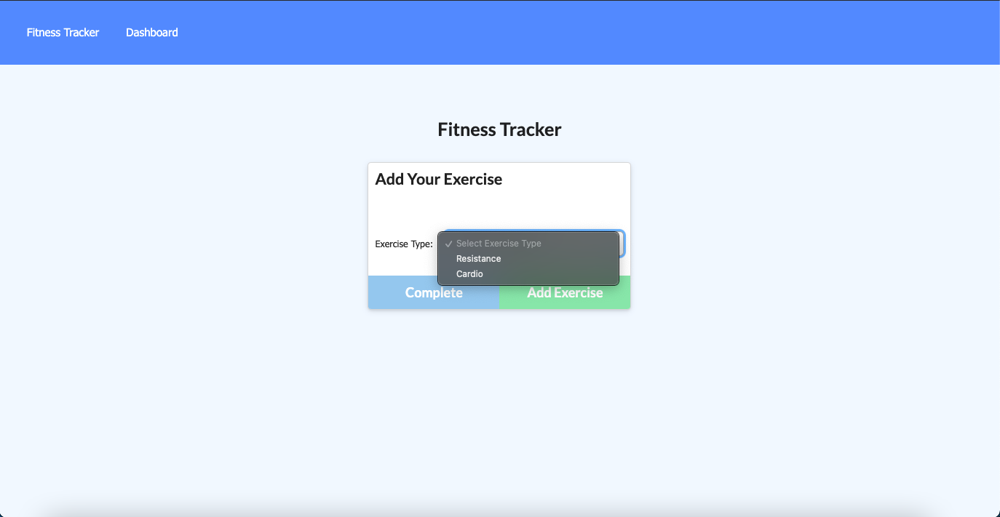
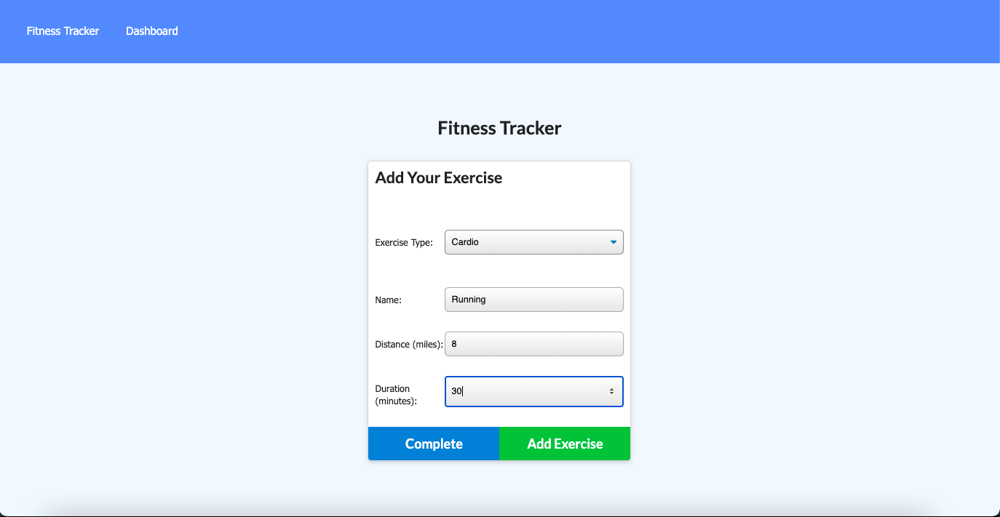
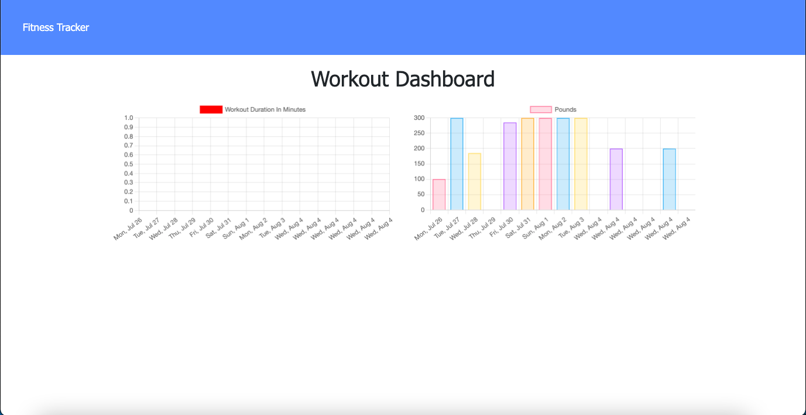

# Workout-Tracker

## Description
With this App you will be able to view create and track daily workouts (track the name, type, weight, sets, reps, and duration of exercise). Also you will be able log multiple exercises in a workout on a given day.

## Installation
This project has been deployed to GitHub. https://github.com/Eduadomtz/Workout-Tracker

To get this project up and running, you can follow the deployment link. 

## Usage
Select the type of workout. 

Insert the data of the exercise. 

Click on Dashboard so you can track your last seven exercises.

## Features
- HTML
- JS
- CSS
- MongoDB

  ## Questions
  If you have any questions about the repo, open an issue or contact me directly at eduardo31794@gmail.com You can find more of my work at https://github.com/Eduadomtz